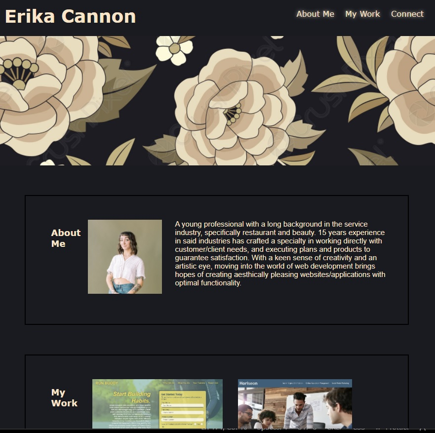

# ec-portfolio
# Portfolio

## Purpose

A website that highlights Erika Cannon, a University of Richmond coding student. The page content includes their name, photo, a short bio explaining their professional experience, current live applications they've created/worked on, and contact information. 

## Built With

- HTML
- CSS

## Website
</img>

https://cannonel.github.io/ec-portfolio/

## Contribution

Erika Cannon

